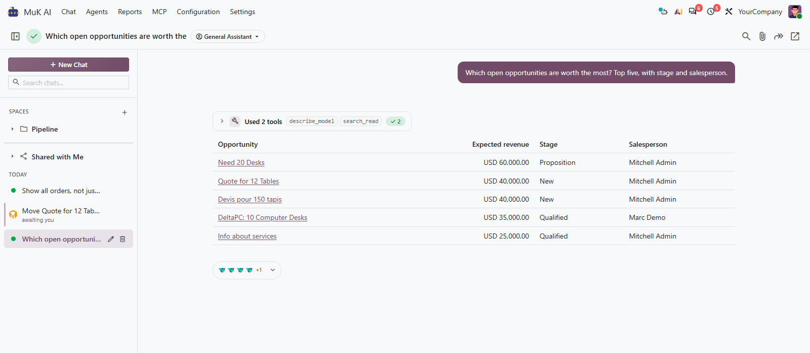
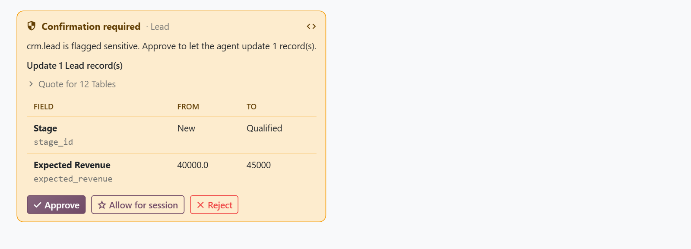

# MuK AI Assistant

[](https://apps.odoo.com/apps/modules/muk_ai)


[](LICENSE)
[](https://youtu.be/JTLvuytqRrg)
[](https://www.mukit.at)

**Ask Odoo in plain words, and let an agent do the work.** A chat inside Odoo
that answers from your data and works on it: OpenAI, Anthropic or Google
models on your own key, agents you set up, and a stop for your approval before
it changes the records you protect.



## Features

- **One chat, on every screen**: a page of its own and a window beside any
  form or list that knows the record you are on; expanding the window takes
  the draft and its files along.
- **Views reshaped on request**: ask for a filter, a grouping or a chart, and
  the list, kanban, pivot or graph in front of you changes in place.
- **Approvals**: on the models you mark as sensitive, the agent shows the
  change field by field and waits for Approve, Allow for session or Reject.
- **Agents**: instructions, provider and model, reasoning effort, tools, web
  search, images and code per agent; read-only enforced by the server, and
  handoff of a chat to the agent that fits.
- **Spaces and sharing**: file chats into spaces with a default agent, and
  share a chat with colleagues who may read it but not steer it.
- **Files, sources and cost**: attach images, PDFs or text, see the records
  each answer was built from, and the context and cost of every turn.



## Getting started

1. Install **MuK AI Assistant** from **Apps**.
2. Open **MuK AI > Configuration > Providers**, pick OpenAI, Anthropic or
   Google, paste the API key and click **Test Connection**.
3. Set the default provider, the default agent and the limits under
   **MuK AI > Settings**.
4. Shape the agents under **MuK AI > Agents**, and mark the models an agent
   has to ask about with **Sensitive for AI** under
   **Settings > Technical > Database Structure > Models**.
5. Open **MuK AI > Chat**, or the robot in the top bar on any screen, and ask.

## Extending

A provider is one class in your own addon, registered in the provider
registry; settings, agents and the model catalogue pick it up:

```python
from odoo.addons.muk_ai.providers import REGISTRY
from odoo.addons.muk_ai.providers.base import ProviderBase


class MistralProvider(ProviderBase):
    name = 'mistral'
    label = 'Mistral'
    default_model = 'mistral-large-latest'
    default_url = 'https://api.mistral.ai/v1'

    def headers(self):
        return {'Authorization': f'Bearer {self.api_key}'}

    def request(self, inputs, tools_schema=None, on_delta=None, model=None, **kwargs):
        ...


REGISTRY[MistralProvider.name] = MistralProvider
```

Tools come from `muk_mcp`: every tool an addon registers there is available
to the agents, and `registry='odoo'` keeps a tool for the agents alone. A tool
that has to run in the user's browser tab is registered in the
`muk_ai.client_tools` registry. The full reference is in `doc/index.rst`.

## Support

Issues and merge requests are welcome. Maintained by
[MuK IT GmbH](https://www.mukit.at), Vienna. Contact: sale@mukit.at
