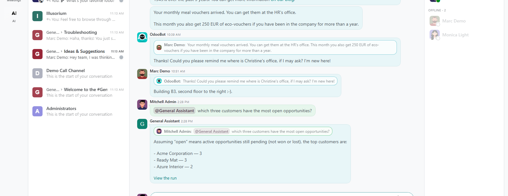
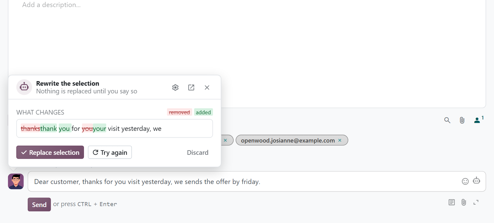

# MuK AI Chatter

**Ask an AI agent in the conversation, and let it help you write.** Mention an
agent of MuK AI Assistant in a Discuss channel or a direct chat, and its
answer lands in that conversation. In the chatter of any record, a writing
helper fixes, rewrites or drafts your message from the thread.

## Features

- **Mentioned like a colleague**: agents are offered with `@` in channels and
  direct chats, without joining them or being mailed.
- **Always an answer**: a mentioned agent never stops to ask; a short note
  answers at once and is replaced by the answer.
- **A writing helper in every composer**: fix, shorten, change the tone,
  translate, or write a reply, a follow-up or a summary, shown as a diff
  before it is applied.
- **Quick actions of your own**: the buttons are Composer skills; an
  instruction that worked is saved as one with a click.
- **Runs on the record**: chats started for a record are listed live in its
  chatter, private to whoever ran them.

## Getting started

1. Install **MuK AI Chatter** from **Apps**; it needs **MuK AI Assistant** and
   **MuK AI Skills** with a provider set up.
2. On the agent form under **MuK AI > Agents**, keep **Answer Mentions** on
   for the agents your team may mention, and reword the quick actions under
   **MuK AI > Skills** if you like.
3. Type `@` and the agent's name in Discuss, or click the AI button in a
   chatter composer.

## Support

Issues and merge requests are welcome. Maintained by
[MuK IT GmbH](https://www.mukit.at), Vienna. Contact: sale@mukit.at
