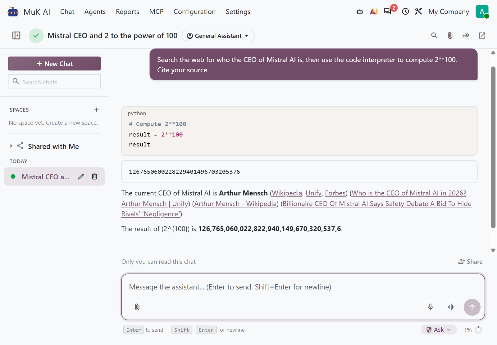
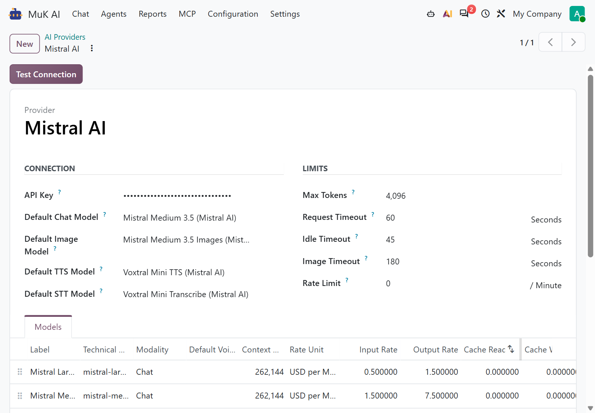

# MuK AI Mistral

**Run your Odoo agents on Mistral.** Add Mistral AI to the MuK AI chat with
your own API key. Its models arrive priced and ready, with tools, web search,
code interpreter and image generation, on Mistral's own API.

## Features

- **Tools and approvals**: the agent calls the same Odoo tools and stops for
  the same approvals; a tool named like one of Mistral's own is renamed on the
  way and back.
- **Web search with sources**: Mistral's own search, with each source cited
  inline where the answer uses it.
- **Code interpreter**: the model runs Python, and the answer shows the code
  and its output.
- **Images, PDFs and JSON**: photos and PDF documents as attachments, and
  structured JSON output where a step needs data.
- **Image generation**: Mistral Medium 3.5 Images is an image model any agent
  can pick, priced per image.
- **Reasoning kept apart**: the model's thinking streams beside the answer; an
  answer cut off at the Max Tokens limit says so.
- **Priced catalogue**: Mistral Large, Medium and Small, Ministral, Codestral
  and Z.ai GLM come with context windows and prices.

## Getting started

1. Install **MuK AI Mistral** from **Apps**; it needs **MuK AI Assistant**.
2. Open **MuK AI > Configuration > Providers > Mistral AI**, paste your Mistral
   API key and click **Test Connection**.
3. Make Mistral the **Default Provider** under **Settings > MuK AI**, or pick
   it on an agent under **MuK AI > Agents**, and switch on **Web Search**, **Code
   Interpreter** or **Image Generation** there.

## Support

Issues and merge requests are welcome. Maintained by
[MuK IT GmbH](https://www.mukit.at), Vienna. Contact: sale@mukit.at
