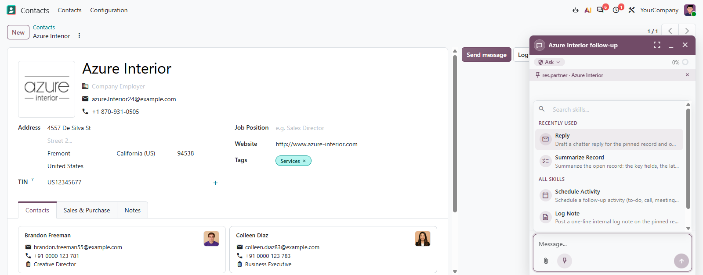
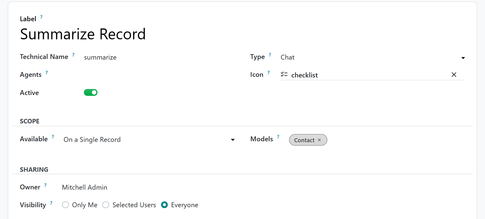

# MuK AI Skills

**Teach the assistant your procedures, and run them in one click.** A skill
is a named procedure for MuK AI Assistant: a line that tells the agent when to
use it, the instructions it follows and the files it needs. The agent picks
one when a request fits, and your users run it from the chat.

## Features

- **The agent chooses**: every skill it may use is in its instructions, and it
  runs the one whose description matches the request.
- **A menu in the chat**: the lightning button beside the paperclip opens a
  searchable list of skills, recently used first.
- **A command of its own**: each skill is a slash command next to the built-in
  ones, and any text after its name goes along with it.
- **Only where it applies**: a skill can need a record, a list or a chatter,
  and certain models; elsewhere it is greyed out and the server refuses it.
- **Files and history**: attach files the agent reads on demand, and restore
  an earlier version of the instructions from Body History.
- **Shared as you choose**: only me, selected users or everyone, and limited
  to the agents it suits. Bodies are plain text, never run as templates.

## Getting started

1. Install **MuK AI Skills** from **Apps**; it needs **MuK AI Assistant** with
   a provider set up.
2. Open **MuK AI > Skills**, or **Manage AI Skills** in the MuK AI settings,
   and create a skill: label, technical name, icon, description, body and
   resources, then its scope and who may use it.
3. In the chat, ask and let the agent pick, click the lightning button, or
   type `/` and the skill's name.

## Support

Issues and merge requests are welcome. Maintained by
[MuK IT GmbH](https://www.mukit.at), Vienna. Contact: sale@mukit.at
