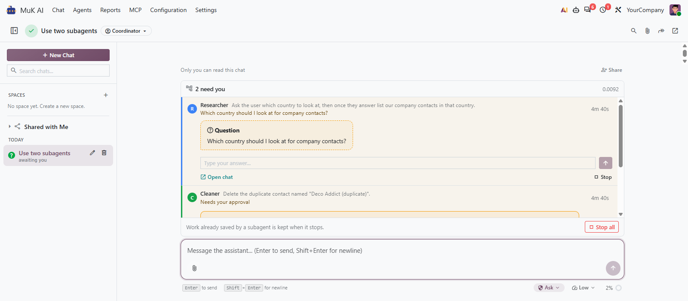
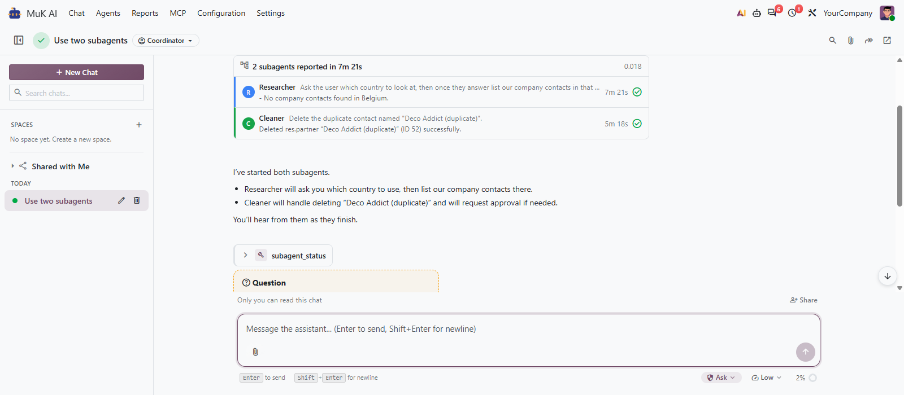

# MuK AI Subagents

**Hand the parts of a request to a team of agents.** Your coordinating agent
splits a request, hands each part to an agent of its own, and keeps talking to
you while they work. Their questions and approvals reach you in the chat, and
the agent answers from their reports.

## Features

- **In the background**: the agent starts its subagents and answers you at once;
  each report wakes it to tell you what the result means.
- **Answer in place**: a question or an approval shows up in the subagent's row
  above the message box, and you answer it there.
- **Steer and resume**: the agent checks on a subagent, gives it new direction
  mid-task, or lets one that stopped carry on where it was.
- **Every subagent is a chat**: open it beside the run, read what it did, and
  send it a message of your own.
- **Rights stay with the chat**: a subagent asks for approval where its chat
  would, stays read-only when its chat is, and gets no tool its lead lacks.
- **No endless loops**: a subagent that repeats the same call is warned, then
  stopped, and every ending is named in its report.

## Getting started

1. Install **MuK AI Subagents** next to MuK AI.
2. Open **MuK AI > Agents**, pick the agent that coordinates, switch on
   **Allow Delegation**, list its **Delegates** and adapt its **Delegation** tab.
3. Chat with that agent and ask for work with independent parts, or name the
   subagents you want. Answer their questions and approvals in the run above the
   message box.

## Support

Issues and merge requests are welcome on the public repository. Paid work, such
as an agent team built for your processes, goes to
[sale@mukit.at](mailto:sale@mukit.at). MuK IT GmbH, Vienna.
