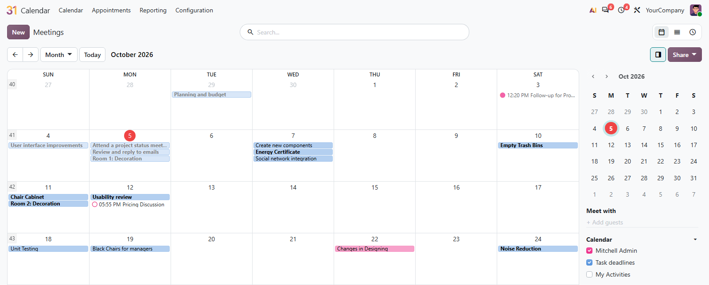
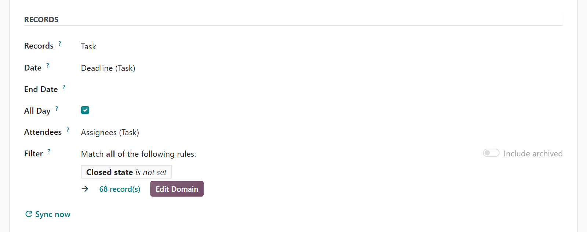

# MuK Calendar

**Any record in your calendar, every calendar in your phone.** A calendar shows
the records of any model on one of their dates, such as task deadlines or
scheduled deliveries, and follows every change. Any calendar can be shared as a
secret iCal link for Google, Apple or Outlook.

## Features

- **Records as events**: pick a model, the date to place its records on, an
  optional end date and a filter.
- **Always current**: creating, moving or deleting a record updates its event
  at once, and a nightly run catches everything else.
- **Attendees from the record**: a contact or user field becomes the event's
  attendees.
- **Read as the owner**: the owner's rights pick the records, and every viewer
  only sees the events of records they may open.
- **iCal subscription**: one link per calendar, with all details or busy times
  only, renewable and revocable.

## Getting started

1. Add the module to your addons path and install it from **Apps**.
2. In **Calendar**, create a calendar from the side panel as an administrator
   and choose the model, the date and the filter. Share it with the users who
   should see it.
3. To subscribe from another app, open a calendar's menu in the side panel of
   **Calendar**, click **Create iCal link** and copy the link.

## Support

Issues and merge requests are welcome. Maintained by
[MuK IT GmbH](https://www.mukit.at), Vienna. Contact: sale@mukit.at
