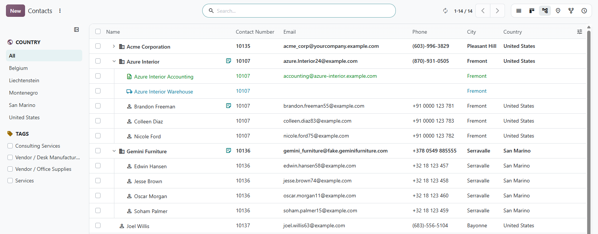
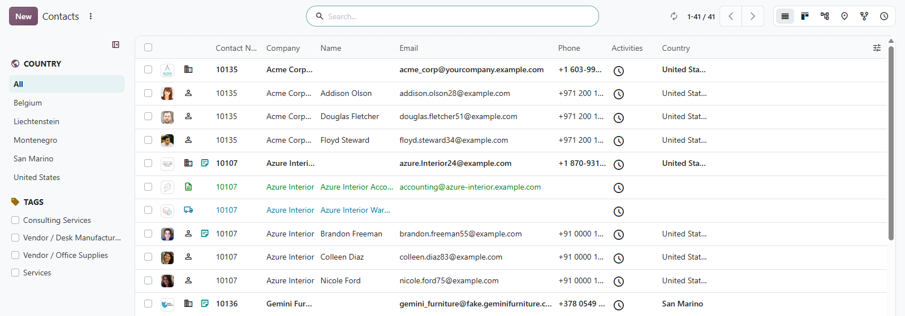
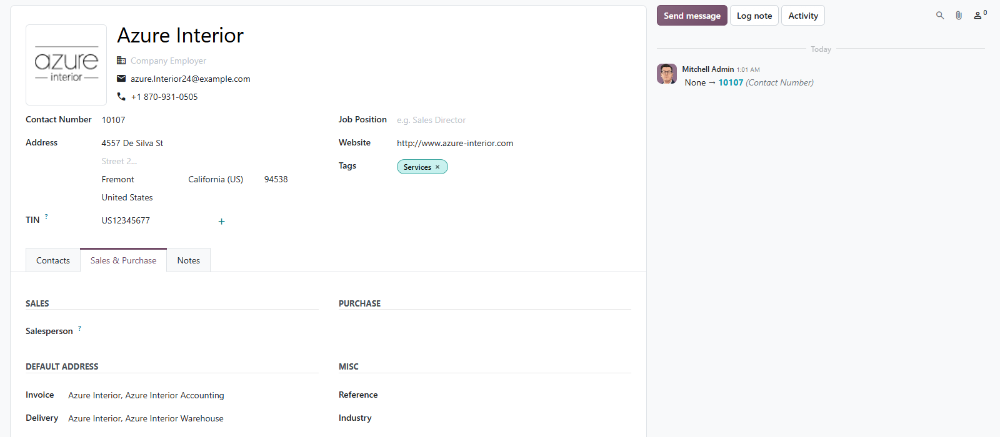

# MuK Contacts

**Number your contacts and see who belongs where.** Every company and person
gets a contact number you can search by. Pick the address that invoices and
deliveries go to, and browse your companies with their people and addresses
nested beneath them.

## Features

- **Contact numbers**: drawn from a sequence when a company or person is
  created, and handed down to its people and addresses.
- **Find by number**: type a contact number wherever a contact is searched.
- **Default addresses**: choose which address receives invoices and which one
  deliveries, instead of the first one found.
- **More in every row**: address type, notes, portal or internal user and the
  company as optional columns of the list.
- **Contacts as a tree**: companies open to their people and addresses, and a
  drag moves a contact to another company.

## Getting started

1. Install **MuK Contacts** from **Apps**.
2. Switch on the contact number automation in **Settings > Contacts**.
3. Set the default invoice and delivery address on the **Sales & Purchase**
   tab of a contact.

## Support

Issues and merge requests are welcome. Maintained by
[MuK IT GmbH](https://www.mukit.at), Vienna. Contact: sale@mukit.at
