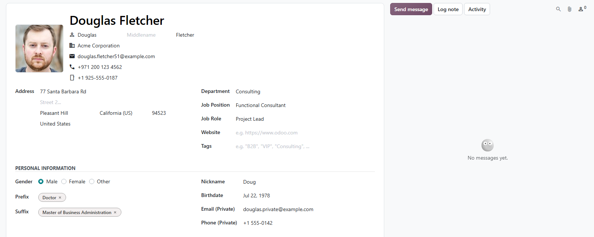
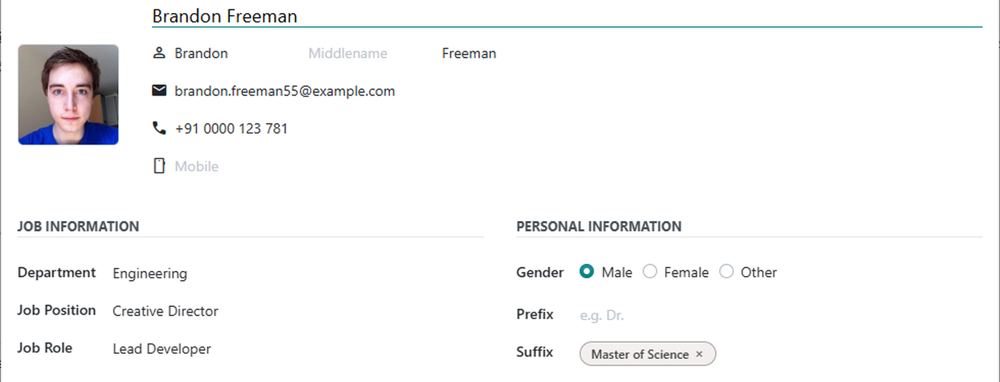

# MuK Contacts vCard

**Full names on your contacts, and vCards that carry them.** First, middle and
last name, honorific titles, a birthday and private numbers on every person,
and a vCard export that brings all of it into a phone or mail address book.

## Features

- **Name parts**: first, middle and last name on every person, and existing
  names are split on install.
- **Honorific titles**: titles before and after the name, such as Dr. or MBA,
  kept in the order you give them.
- **Personal details**: gender, nickname, birthdate, and a private email and
  phone next to the business ones.
- **Mobile number**: a mobile field next to the phone, with its own call
  button, found by the phone search.
- **Richer vCards**: Download (vCard) exports all of it, plus tags, notes, time
  zone and the invoice and delivery addresses of a company.

## Getting started

1. Install **MuK Contacts vCard** from **Apps**.
2. Manage the titles under **Contacts > Configuration > Contact Honorifics**.
3. Open a contact, or select several in the list, and choose
   **Download (vCard)** in the action menu.

## Support

Issues and merge requests are welcome. Maintained by
[MuK IT GmbH](https://www.mukit.at), Vienna. Contact: sale@mukit.at
