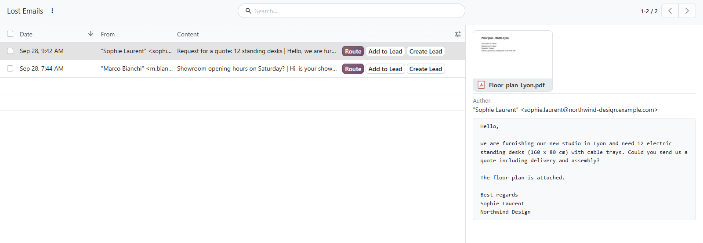
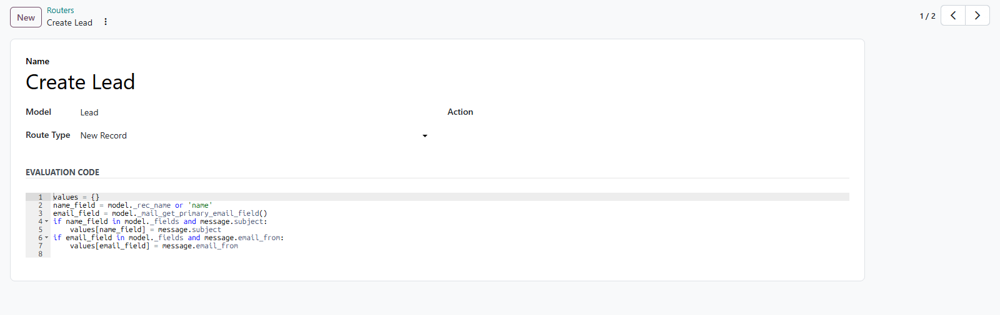

# MuK Mail Routing

**No email gets lost on the way in.** Emails that match no alias and no
conversation are kept as Lost Emails instead of bouncing. Route each one to a
new or an existing record, in one click with a router.

## Features

- **Lost Emails**: incoming mail without a home, with sender, content and
  attachments, read in a preview beside the list.
- **A new record per email**: a router creates a lead, a ticket or any record
  from each email, and moves the email onto it.
- **Attach to an existing one**: a router asks which record the email belongs
  to, and can notify its followers.
- **Route without a router**: pick any kind of record, then the record itself,
  and the selected emails move there.
- **Failed Emails**: outgoing mail that could not be delivered, with the reason
  and a button to send it again.

## Getting started

1. Install the module from **Apps**.
2. Open **Discuss > Lost Emails** and route an email with **Route**.
3. For one-click routing, create a router under **Discuss > Configuration >
   Routers**: the target model, and whether an email creates a new record or
   is attached to an existing one.

## Support

Issues and merge requests are welcome on the public repository; no response
time is promised. A router built for your process, or a fix on a deadline, is
paid work. Maintained by [MuK IT GmbH](https://www.mukit.at), Vienna. Contact:
sale@mukit.at
