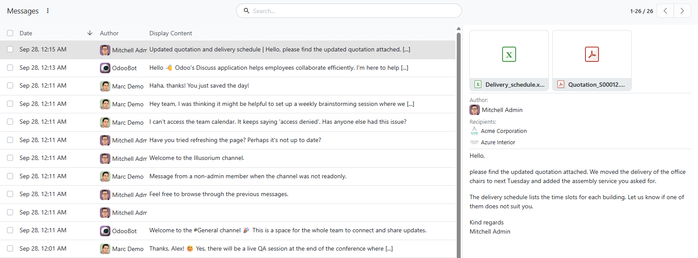
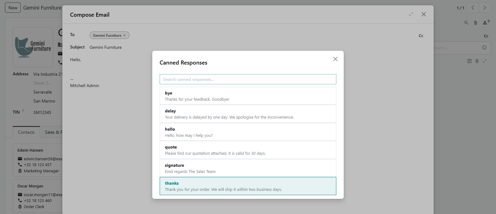

# MuK Mail Utils

**Read a message without opening it.** A message list with a preview pane
beside it, and your canned responses in every HTML editor. Other MuK mail
modules build their message lists on it.

## Features

- **Preview pane**: the message body, author, recipients and attachments render
  beside the list, so a long list is read row by row without opening a form.
- **Keyboard friendly**: the arrow keys move through the list and the preview
  follows the row that has the focus.
- **Attachments in view**: files show as the same cards as in the chatter, to
  open or download.
- **Canned responses in any editor**: type `/` in any HTML field, including the
  full email composer, and pick **Canned Response**.
- **Saved answers, searchable**: the dialog filters your canned responses as you
  type and inserts one with Enter.

## Getting started

1. Install the module from **Apps**. Nothing to configure: it uses the canned
   responses Discuss already has.
2. Type `/` in an HTML editor and pick **Canned Response**, or open a message
   list that uses the preview view.

## For developers

Open a message list with `js_class="message_list"` to get the preview pane. The
pane appears on extra-large screens.

## Support

Issues and merge requests are welcome on the public repository; no response
time is promised. A mail feature built for your team, or a fix on a deadline,
is paid work. Maintained by [MuK IT GmbH](https://www.mukit.at), Vienna.
Contact: sale@mukit.at
