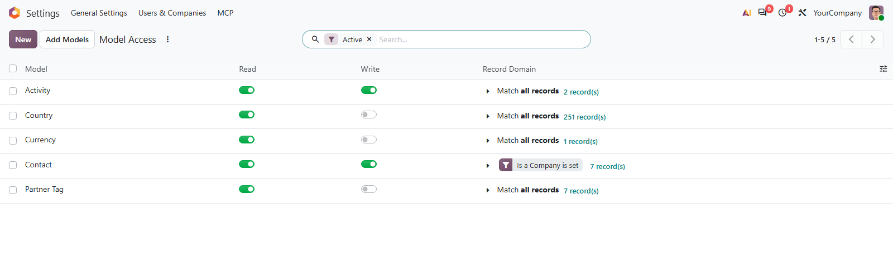
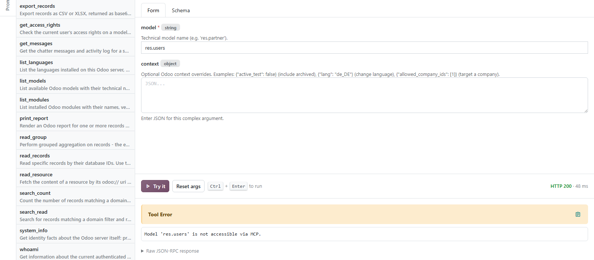

# MuK MCP Access

**Decide which models an AI agent can reach.** An allowlist for the MuK MCP
Server: the models an agent may read, the ones it may also change, and the
records it sees in each. Whatever is not on the list stays out of reach,
whoever the key belongs to.

## Features

- **Only what you list**: once the list holds a model, every other one is
  refused, and the model listing no longer names it.
- **Read or write, per model**: create, update, delete and method calls need
  the write switch.
- **A record domain per model**: like a record rule for agents, built in
  Odoo's domain editor, with `user`, `company_id` and `company_ids` available.
- **Every way in**: reads, writes, exports, reports, method calls and the files
  behind a record go through the same check.
- **Off without uninstalling**: archive the entries and the server is open
  again.

## Getting started

1. Install the module next to **MuK MCP Server**. Nothing changes until the
   first model is listed.
2. Open **Settings > MCP > Authentication > Access** and use **Add Models**.
3. Switch on **Write** where the agent should change data, and add a
   **Record Domain** where it should see only part of a model.

## Support

Issues and merge requests are welcome. Maintained by
[MuK IT GmbH](https://www.mukit.at), Vienna. Contact: sale@mukit.at
