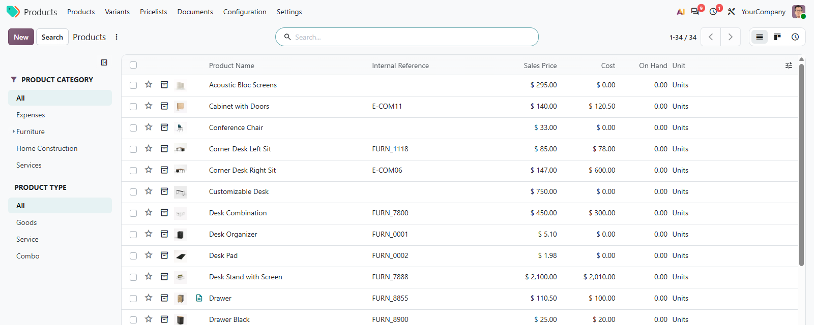
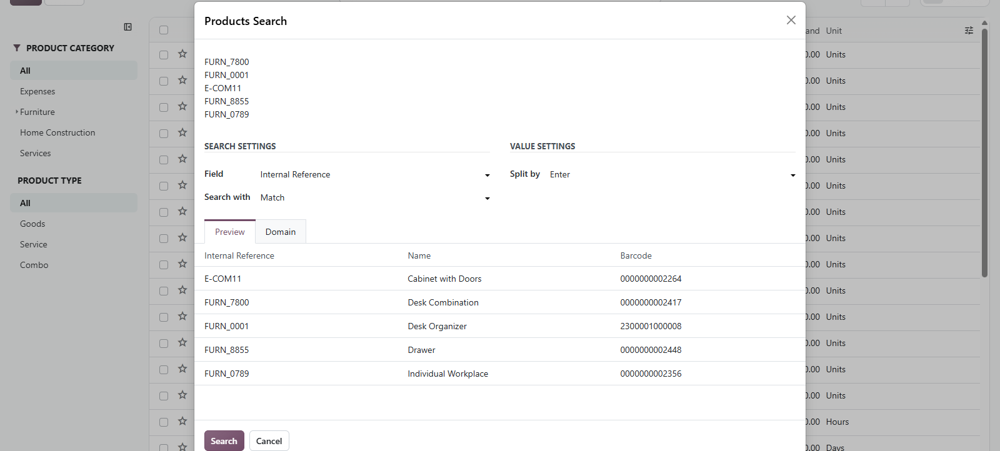

# MuK Product

**Every product list and setting, in one app.** Products, variants,
pricelists, documents and their configuration under one icon on the home menu,
and every new product gets its internal reference and EAN-13 barcode on its
own.

## Features

- **Every product menu**: products, variants, pricelists, documents, combo
  choices, units, packaging barcodes and base units, without Sales or
  Inventory.
- **References and barcodes**: sequences fill in missing codes, barcodes carry
  an EAN-13 check digit and references stay unique.
- **Bulk search**: paste a column of references, names or barcodes, preview the
  matches and open exactly those products.
- **Manufacturer details**: manufacturer, product name, code and URL, and the
  code is found by every product search.
- **Search panels**: filter products and variants by company, category, type,
  attribute and tag in one click.
- **Fixed prices in one list**: the fixed prices of every pricelist and product,
  edited inline.

## Getting started

1. Install the module from **Apps** and open **Products** from the home menu.
2. Switch features on under **Products > Settings**: the **Catalog** block for
   variants, pricelists, units and base unit prices, the **Automation** block
   for the automatic reference and barcode.
3. Click **Search** next to **New** to open the bulk search.

## Support

Issues and merge requests are welcome on the public repository; no response
time is promised. A numbering scheme built for your catalog, or a fix on a
deadline, is paid work. Maintained by [MuK IT GmbH](https://www.mukit.at),
Vienna. Contact: sale@mukit.at
