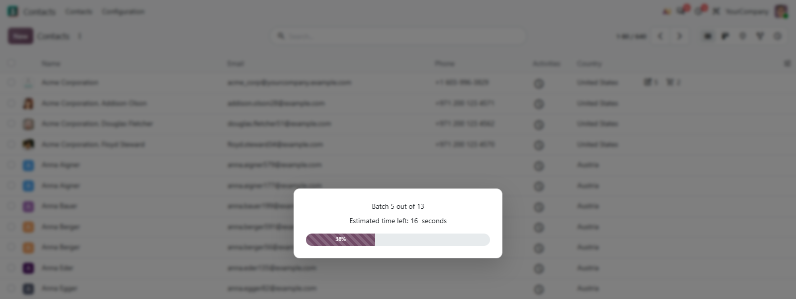
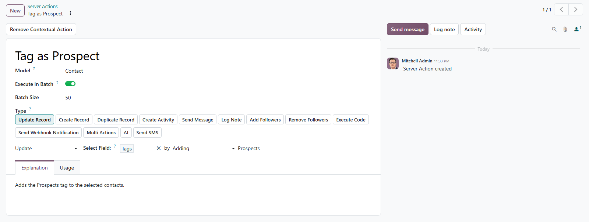

# MuK Batch Actions

**Run big selections in batches, not in one request.** Server actions and
reports from the Actions and Print menus run in slices of a size you choose,
behind a progress bar, and each slice is its own transaction.

## Features

- **Below the server timeout**: one request per batch, so thousands of
  selected records never have to fit into a single call.
- **Progress you can watch**: a progress bar counts the batches and estimates
  the time left.
- **One file per record**: a batched report downloads a PDF for every selected
  record instead of one merged document.
- **A failure stops, it does not undo**: each batch commits on its own, and the
  batches before a failing one stay saved.
- **Standard until you flag it**: actions and reports without Execute in Batch
  behave exactly as in standard Odoo.

## Getting started

1. Install the module from **Apps**.
2. In debug mode, turn on _Execute in Batch_ on a server action in **Settings >
   Technical > Server Actions** and set its _Batch Size_, or on a PDF or text
   report in **Settings > Technical > Reports**. It must be in the Actions or
   Print menu of its model.
3. Select records and pick the action or report as usual.

## Support

Issues and merge requests are welcome on the public repository; they are read,
but no response time is promised. Maintained by
[MuK IT GmbH](https://www.mukit.at), Vienna. Contact: sale@mukit.at
