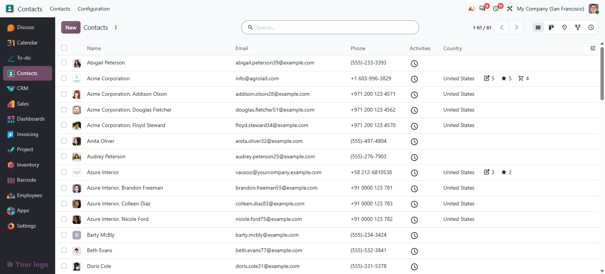
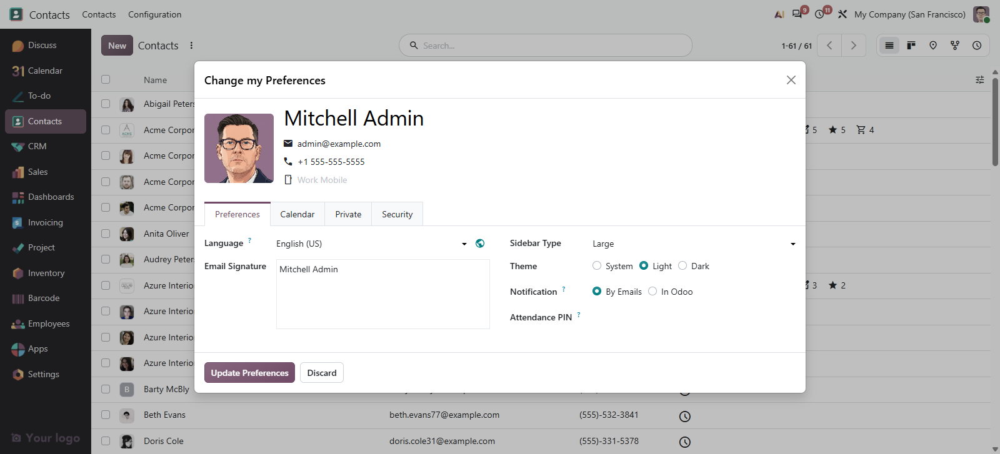

# MuK AppsBar

**Every app one click away, on every screen.** A sidebar lists the apps a user
may open, beside the web client instead of behind the home menu, at the width
that user chose and with the company logo at its foot.

## Features

- **One click between apps**: the bar lists the apps your access rights allow
  and marks the one you are in.
- **Your own order**: on Enterprise, the order of the home menu is the order of
  the bar.
- **Each user sets the width**: large with names, small with icons, or hidden,
  in that user's own preferences.
- **A logo per company**: an image on the company fills the foot of the bar and
  follows the active company.

## Getting started

1. Install the module from **Apps**.
2. Set the company image in **Settings > General Settings**, under AppsBar.
3. Each user picks a size in **My Preferences > Sidebar Type**.

## Support

Issues and merge requests are welcome. Maintained by
[MuK IT GmbH](https://www.mukit.at), Vienna. Contact: sale@mukit.at
