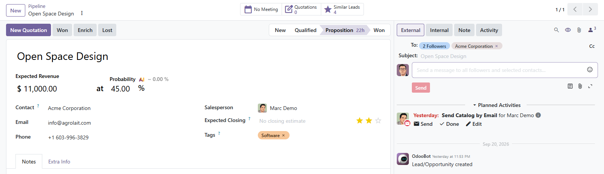
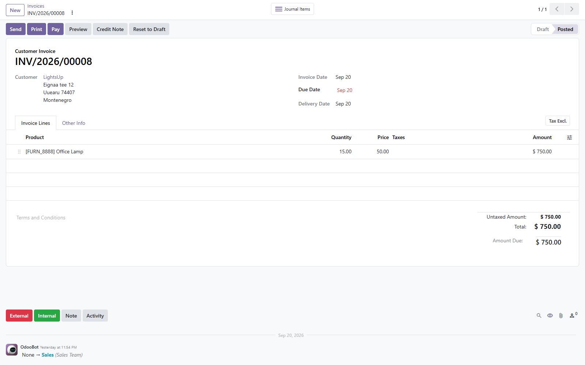

# MuK Chatter

**The chatter, on the terms of the person reading it.** Each user puts it beside
the form or under it, drags it as wide as they want and hides the tracking
messages. Sending is split in three: to the customer, to colleagues, or to
nobody at all.

## Features

- **Side or bottom**: the position is a field in each user's own profile.
- **Drag it wider**: pull the left edge, double-click the handle to reset. The
  width is kept per browser.
- **Hide the tracking**: one button drops field changes and system messages.
- **External, Internal, Note**: an internal note notifies every colleague
  following the record, and anyone you add, without emailing the customer.

## Getting started

1. Install the module from **Apps**.
2. Pick a position in **My Preferences > Chatter Position**.
3. Drag the chatter edge, or hide the tracking messages, on any record.

## Support

Issues and merge requests are welcome. Maintained by
[MuK IT GmbH](https://www.mukit.at), Vienna. Contact: sale@mukit.at
