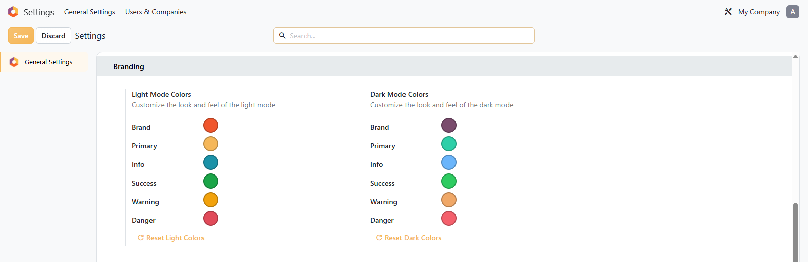
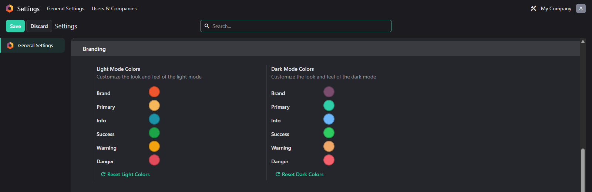

# MuK Colors

**Your brand, everywhere Odoo shows a colour.** An administrator picks the brand
and primary colour in the general settings, and the whole web client follows,
along with the four context colours and a separate palette for Enterprise dark
mode.

## Features

- **Six colours, one screen**: brand, primary, info, success, warning and
  danger, each a colour picker in the general settings.
- **Dark mode set separately**: Enterprise dark mode has its own six colours.
- **Configuration, not a theme**: stored as settings, so an upgrade keeps them
  and uninstalling restores the defaults.
- **Reset per mode**: one button per palette returns it to stock.

## Getting started

1. Add the module to your addons path and install it from **Apps**.
2. Open **Settings > General Settings > Light Mode Colors**, and
   **Dark Mode Colors** on Enterprise.
3. Pick the colours, save and reload.

## Support

Issues and merge requests are welcome. Maintained by
[MuK IT GmbH](https://www.mukit.at), Vienna. Contact: sale@mukit.at
