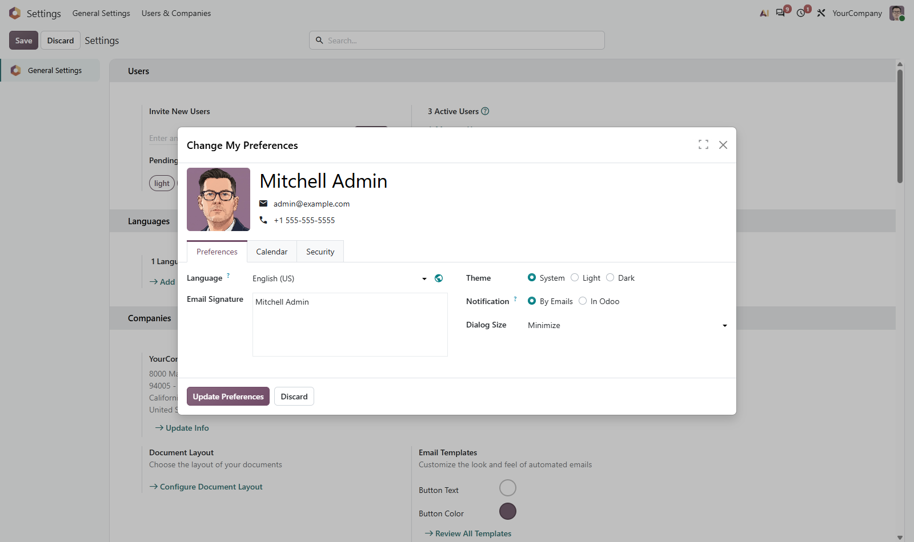
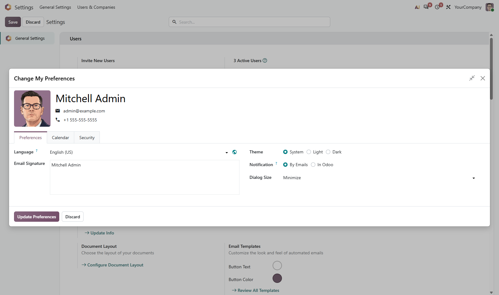

# MuK Dialog

**Dialogs that open at the size you work in.** A control in the header of every
dialog fills the window and brings it back again, and a preference per user
decides how dialogs open in the first place.

## Features

- **Every dialog**: the control sits beside the close button of every dialog
  that holds a form, composers and pickers included.
- **Back to where it was**: a second click returns the dialog to the size it
  opened at.
- **Short prompts stay short**: a yes-or-no confirmation keeps the frame Odoo
  gives it.
- **Decided once, by each user**: Dialog Size in My Preferences sets the
  starting size, Minimize or Maximize.

## Getting started

1. Install the module from **Apps**.
2. Click the control in any dialog header to fill the window.
3. To open dialogs full screen, set **My Preferences > Dialog Size**.

## Support

Issues and merge requests are welcome. Maintained by
[MuK IT GmbH](https://www.mukit.at), Vienna. Contact: sale@mukit.at
