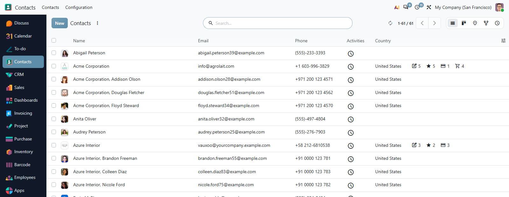
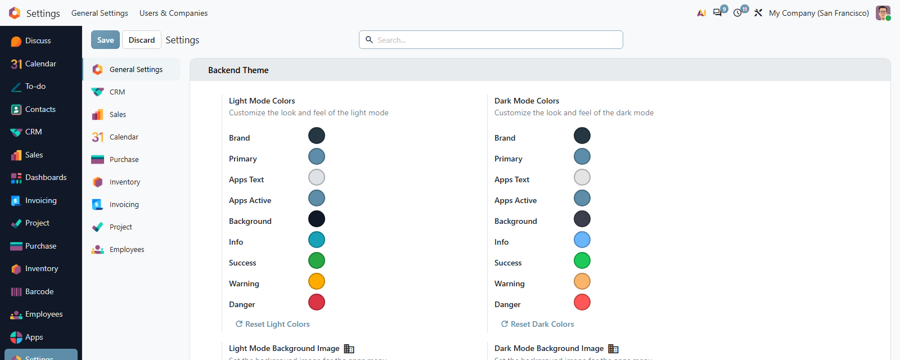
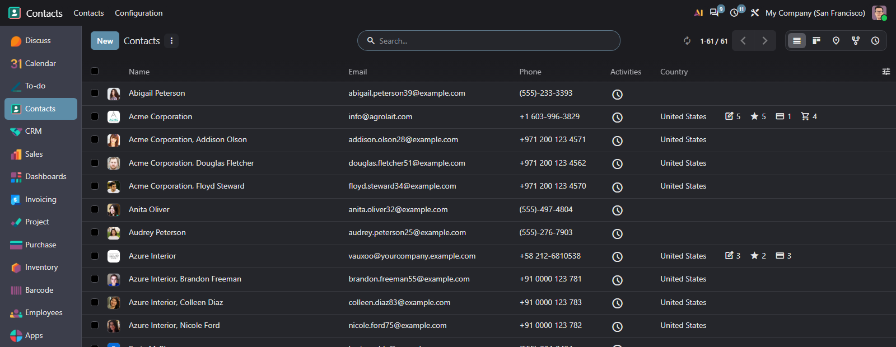

# MuK Backend Theme

**The Enterprise backend, in your colours.** Every app in a bar down the side,
your own background on the home menu, and a full palette for light and dark
mode, set from the settings rather than forked into the source.

## Features

- **App bar and home menu**: apps down the side at every width, and a home menu
  background per company, one for light mode and one for dark.
- **Colours from the settings**: brand, primary, context and app bar colours
  for light and dark mode, reset in one click.
- **Yours without a fork**: the values are written into a customized asset, so
  an upgrade has nothing to merge.
- **Eight modules, one install**: the app bar, colours, chatter, dialogs, group
  controls, refresh button and list tools arrive together.

## Getting started

1. Install the module from **Apps** on Odoo Enterprise.
2. Set the colours, backgrounds and favicon in **Settings > General Settings >
   Backend Theme**.
3. Each user sets the sidebar, chatter and dialog size in **My Preferences**.

## Support

Issues and merge requests are welcome. Maintained by
[MuK IT GmbH](https://www.mukit.at), Vienna. Contact: sale@mukit.at
