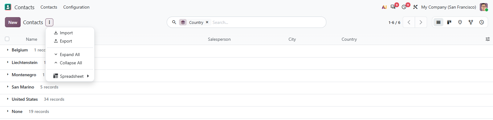
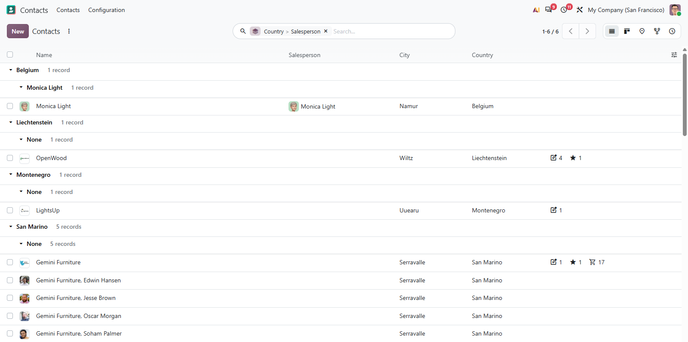

# MuK Groups

**Open every group, or close them all, in one click.** Two entries in the cog
menu of any grouped list or kanban, and they work all the way down, through
every level of the grouping, to the records themselves.

## Features

- **Expand All**: unfolds every group, then every group inside those, until the
  records are on screen.
- **Collapse All**: folds the tree back from the innermost level up.
- **Lists and kanban alike**: the same two entries wherever a view is grouped.
- **One read per level**: a whole level opens in a single request, so a wide
  grouping stays quick.

## Getting started

1. Install the module from **Apps**.
2. Group any list or kanban view by one or more fields.
3. Open the **cog menu** and choose **Expand All** or **Collapse All**.

## Support

Issues and merge requests are welcome. Maintained by
[MuK IT GmbH](https://www.mukit.at), Vienna. Contact: sale@mukit.at
