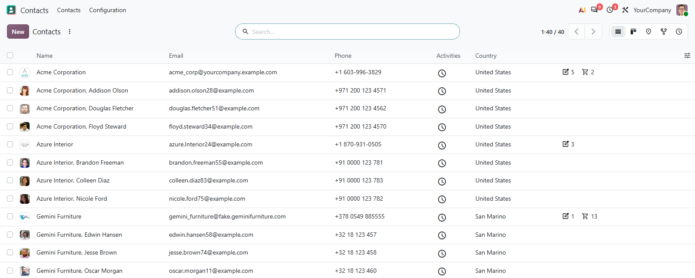
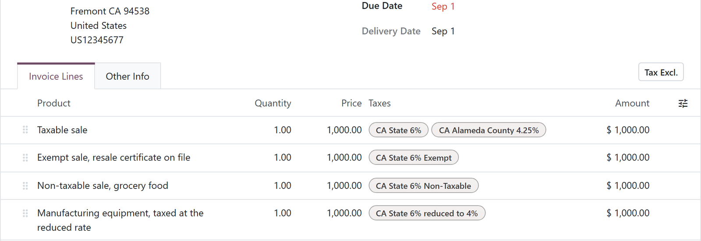

# MuK List Columns

**Resize a column once. It stays that way.** Drag the edge of a list column to
the width you need, and every list of that model opens at that width from then
on, for you, in this browser, until you double-click the handle to go back.

## Features

- **Kept after a reload**: the width you drag is the width you get back, the
  next morning too.
- **Any list, any model**: top-level lists and the lists inside a form, grouped
  columns included.
- **Yours, not everyone's**: widths are saved per user and per database in the
  browser.
- **One double-click back**: double-click a resize handle to return to the
  automatic widths.

## Getting started

1. Install the module from **Apps**.
2. Drag the edge of a column header to resize it.
3. Double-click a resize handle to reset the list.

## Support

Issues and merge requests are welcome. Maintained by
[MuK IT GmbH](https://www.mukit.at), Vienna. Contact: sale@mukit.at
