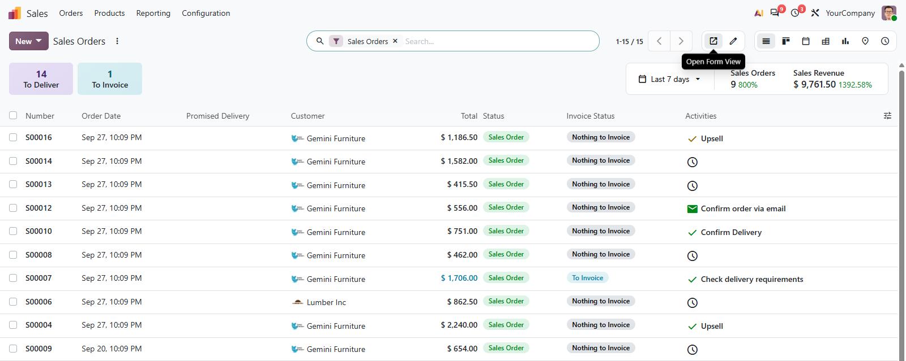
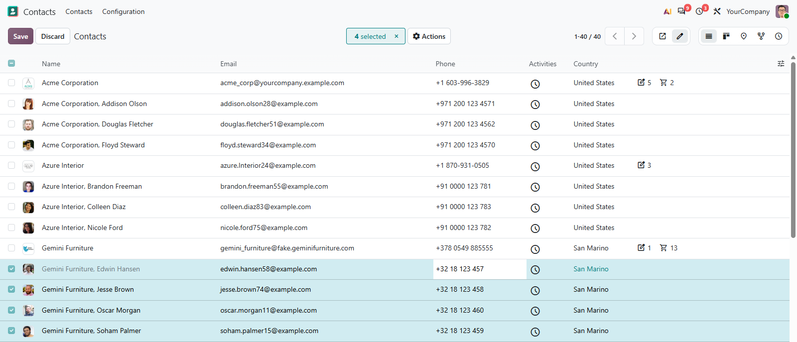

# MuK List Mode

**Open the form or edit in the row, list by list.** A switch beside the pager
decides what a click on a row does: open the record in its form, as Odoo always
has, or edit it right there in the list, several rows at once if you select
them. The lines inside a form get the same choice.

## Features

- **Open Form View**: a click on a row opens the record in its form, with the
  breadcrumb back to the list.
- **Inline Edit Mode**: click a cell, type, move on with Tab; tick several rows
  and one value is written to all of them.
- **Inside forms too**: order lines and every other list in a form carry a
  toggle of their own in the header.
- **Remembered per list**: the mode is kept per user, action and model, and per
  field for the lists in a form.
- **Only where editing is allowed**: without the right to edit, or on a
  read-only list, the switch does not appear.

## Getting started

1. Install the module from **Apps**. There is nothing to configure.
2. Open any list you are allowed to edit and pick **Open Form View** or
   **Inline Edit Mode** beside the pager.
3. In a form, use the toggle in the last column header of a line list.

## Support

Issues and merge requests are welcome. Another mode, a default per list or a fix
on a deadline is paid work, quoted up front. Maintained by
[MuK IT GmbH](https://www.mukit.at), Vienna. Contact: sale@mukit.at
