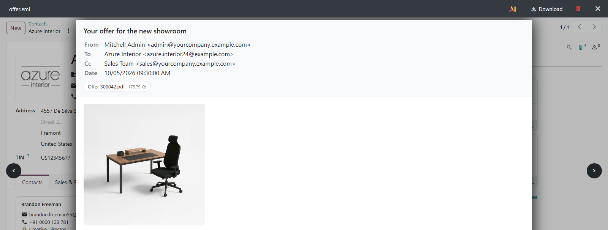
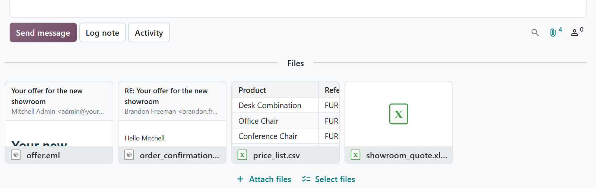

# MuK Preview

**Open the email, not the download folder.** Email files, Outlook messages and
CSV exports open in the Odoo file viewer and show a preview on their chatter
card. Reports can be read before they are downloaded, remote images stay
blocked until you ask for them, and Word, Excel and PowerPoint can open in the
Office Online viewer.

## Features

- **Email and Outlook files**: an `.eml` or `.msg` shows its header, its body
  with embedded pictures and its attachments, read in plain Python.
- **CSV and TSV tables**: an export becomes a table, whatever its delimiter and
  encoding.
- **Previews on the card**: the chatter card shows the subject and sender of a
  mail, or the first rows of a table.
- **Remote images on request**: blocked until one click loads them for that
  message.
- **Office Online**: Word, Excel and PowerPoint in the Microsoft viewer, through
  a signed link that expires after five minutes.
- **Report preview**: the eye next to a report in the Print menu shows it in
  the file viewer; on request, every downloaded report opens in a new tab too.

## Getting started

1. Add the module to your addons path and install it from **Apps**.
2. Click an email, Outlook or CSV attachment anywhere in Odoo, or the eye next
   to a report in the **Print** menu; it opens in the file viewer.
3. For Office files, enable **Settings > General Settings > MS Office Preview**.
   The database must be reachable from the internet.
4. To open downloaded reports in a new tab as well, enable
   **Settings > General Settings > Open Downloaded Reports**.

## Support

Issues and merge requests are welcome. Maintained by
[MuK IT GmbH](https://www.mukit.at), Vienna. Contact: sale@mukit.at
