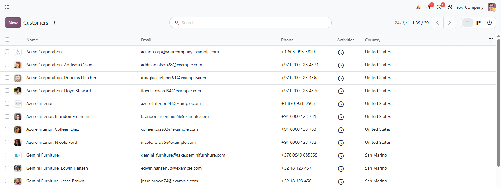
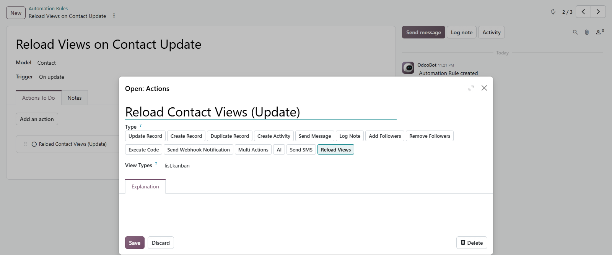

# MuK Refresh

**Reload the view you are on, without leaving it.** A refresh button beside the
pager. Double-click it and the view keeps itself current, and an automation rule
can push a reload to everyone who has that model open.

## Features

- **Click to reload**: the reload goes through the pager, so filters, grouping
  and your place in the list survive it.
- **Double-click for auto**: lists and kanban views reload on a timer, with a
  countdown next to the button; the choice is kept per view.
- **Quiet in the background**: a hidden tab stops polling until you come back.
- **Reload Views action**: a server action type for automation rules that
  refreshes the open views of a model for every user at once.

## Getting started

1. Install the module from **Apps**.
2. Click the refresh button left of the pager to reload once; double-click it
   on a list or kanban view to turn auto refresh on or off.
3. To refresh from the backend, add a **Reload Views** action to an automation
   rule under **Settings > Technical > Automation Rules**. Leave **View Types**
   empty for every view, or name them, e.g. `list, kanban`.

The auto refresh interval is the system parameter
`muk_web_refresh.pager_autoload_interval`, in milliseconds (default `30000`).

## Support

Issues and merge requests are welcome. A different interval, another trigger or
a fix on a deadline is paid work, quoted up front. Maintained by
[MuK IT GmbH](https://www.mukit.at), Vienna. Contact: sale@mukit.at
