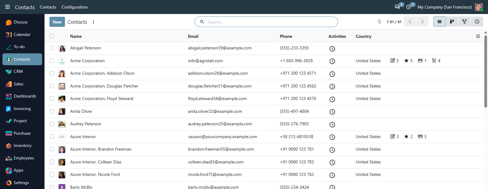
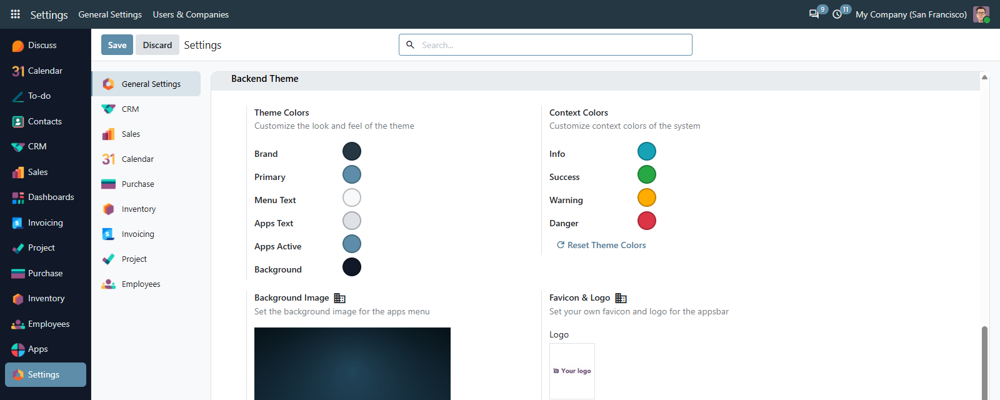

# MuK Backend Theme

**The backend your team looks at all day, redesigned.** Every app in a bar down
the side, an apps menu over a background of your own, and your brand colours
set from the settings, not forked into the source.

## Features

- **App bar and apps menu**: apps down the side at every width, and a
  full-window menu over a background image set per company.
- **Colours from the settings**: brand, primary, the context colours and the
  bar's own palette, reset in one click.
- **Chatter beside the record**: the form keeps its full width; each user
  chooses where the chatter sits.
- **Eight modules, one install**: the app bar, colours, chatter, dialogs, group
  controls, refresh button and list tools arrive together.
- **Down to a phone**: the same backend at 390px, with the apps in a drawer.

## Getting started

1. Install the module from **Apps**. The new design applies at once.
2. Set the colours, the apps-menu background and the favicon under
   **Settings > General Settings > Backend Theme**.
3. Each user picks the sidebar width, the chatter position and the dialog size
   in their preferences.

## Support

Issues and merge requests are welcome. A theme built to your brand, or a fix on
a deadline, is paid work, quoted up front. Maintained by
[MuK IT GmbH](https://www.mukit.at), Vienna. Contact: sale@mukit.at
