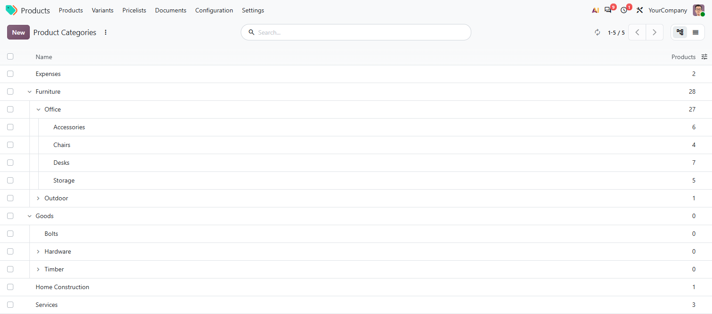
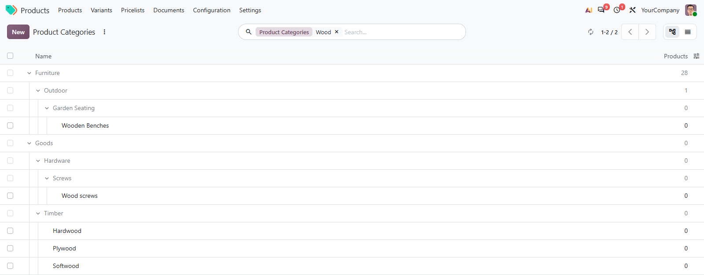

# MuK Tree List

[](https://apps.odoo.com/apps/modules/muk_web_tree)


[](LICENSE)
[](https://youtu.be/FFZvYAT0uQo)
[](https://www.mukit.at)

**Nest your records under their parents, in one list.** A new view type for any
model that points to itself: categories, contacts, departments, locations. Rows
open like folders, and everything a list can do, from inline editing to sums,
still works.



## Features

- **Rows that nest**: each record sits indented under its parent; opened rows
  stay open the next time.
- **Only what you open is loaded**: the top level is paged, the children of a
  row are read when you open it.
- **Search in place**: matches stay at their depth, under their greyed-out
  parents.
- **Add a child on the row**: the + on a row starts a record right under it,
  with the parent filled in.
- **Move by drag and drop**: drop a row on another to move it; a record never
  ends up inside its own children.
- **Totals of a branch**: a rollup column shows each parent the total of its
  subtree.



## Getting started

1. Install the module from **Apps**. It brings the view type, not the views.
2. Add a `treelist` view next to the list and form of an action, and
   `treelist` to the action's view mode.
3. Open the action and click the chevron of a row to open it.

## Developer reference

```xml
<treelist parent_field="parent_id" editable="bottom" draggable="1">
    <field name="name"/>
    <field name="budget" sum="Total" rollup="1"/>
</treelist>
```

- `parent_field`: the many2one to the same model, `parent_id` by default.
- `expand="1"`: open every row when the view is first loaded.
- `draggable="1"`: move a record under another one by drag and drop.
- `rollup="1"` on a numeric field: subtree totals on parent rows and in the
  footer.

## Support

Issues and merge requests are welcome. A tree list set up on your own models, or
a fix on a deadline, is paid work, quoted up front. Maintained by
[MuK IT GmbH](https://www.mukit.at), Vienna. Contact: sale@mukit.at
