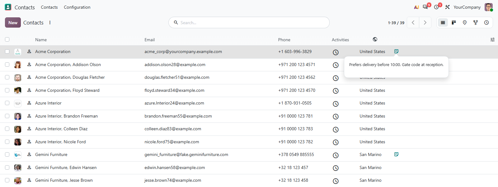

# MuK Web Utils

[](https://apps.odoo.com/apps/modules/muk_web_utils)


[](LICENSE)
[](https://www.mukit.at)

**The small pieces other modules build on.** Field widgets, view options and
Python helpers that a module declares as a dependency, plus a few fixes to the
stock web client. On its own it adds a quick-create switch and a Reports entry
in the debug menu.



## Features

- **Selection as icons**: each value maps to an icon, with the label as its
  tooltip.
- **Text behind an icon**: a long note shows as one icon; a click opens the
  full text in a popover.
- **Icon column headers**: an `icon` attribute on a list field replaces the
  header label.
- **No accidental records**: one setting stops many2one fields creating a
  record from a typed name.
- **Progress for long jobs**: a blocking progress bar with a time estimate, and
  a client action that runs several actions in a row.
- **Fixes that apply everywhere**: the domain field stops false warnings, the
  tour pointer stays visible over dialogs.

## Getting started

1. Add `muk_web_utils` to the `depends` of your module's manifest.
2. Use the widgets and options in your views, and import the Python helpers
   from `odoo.addons.muk_web_utils.tools`.
3. To disable quick create, enable it in debug mode under
   **Settings > General Settings > Permissions**.

## Developer reference

```xml
<field name="state" widget="selection_icons" options="{'icons': {'done': 'check'}}"/>
<field name="comment" widget="text_icon"/>
<field name="line_ids" widget="one2many" options="{'no_open': 1}"/>
<field name="payload" widget="json" options="{'prettify': 1}"/>
<field name="country_id" icon="public"/>
```

Also available: the `module_link` widget, the `multi_actions` client action,
the `block_progress` service and the helpers in `tools`.

## Support

Issues and merge requests are welcome. A widget built for your views, or a fix
on a deadline, is paid work, quoted up front. Maintained by
[MuK IT GmbH](https://www.mukit.at), Vienna. Contact: sale@mukit.at
