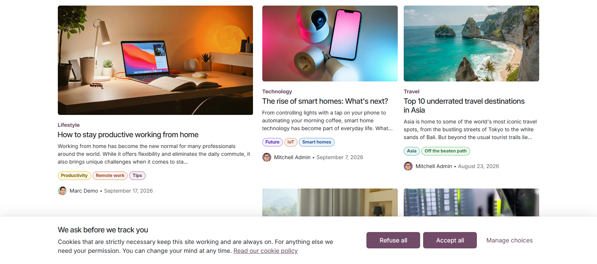
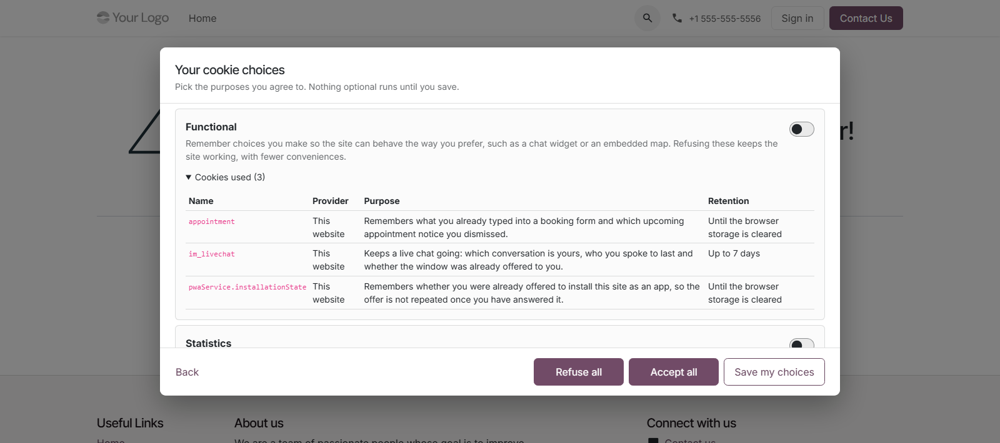
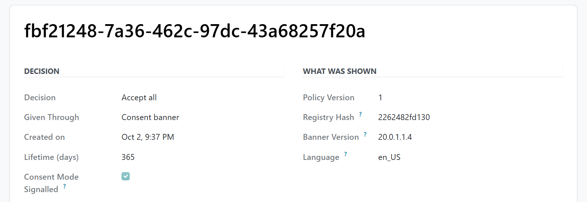

# MuK Cookie Consent

**Ask per purpose, block until granted, keep the proof.** A consent manager in
place of Odoo's cookies bar: a choice per purpose, third-party scripts held back
per service, Google Consent Mode v2 and a record of every decision.

## Features

- **A choice per purpose**: functional, statistics and marketing switched on one
  by one, each listing the cookies it covers.
- **Blocking per service**: scripts and embeds are removed server-side until
  their purpose is granted; one click allows a single embed.
- **Consent Mode and GPC**: all seven Google Consent Mode v2 signals, basic or
  advanced, and Global Privacy Control always honoured.
- **A consent log**: every decision filed append-only with the disclosure the
  visitor was shown, never a readable IP.
- **A registry and a weekly scan**: Odoo's own cookies declared out of the box,
  undeclared ones put up for review.
- **Usable by everyone**: WCAG 2.2 AA, in English, German, French, Spanish and
  Italian.

## Getting started

1. Install the module from **Apps**.
2. Turn on **Cookies Bar** in the **Cookie Consent** section of
   **Website > Configuration > Settings**, and pick the Consent Mode, the policy
   version and the policy page.
3. Set the layout in the website editor by selecting the Cookies Bar block, and
   add your own third parties under **Website > Configuration > Cookie
   Consent**.

## Support

Issues and merge requests are welcome. A registry filled in for your own third
parties, or a fix on a deadline, is paid work, quoted up front. Maintained by
[MuK IT GmbH](https://www.mukit.at), Vienna. Contact: sale@mukit.at
